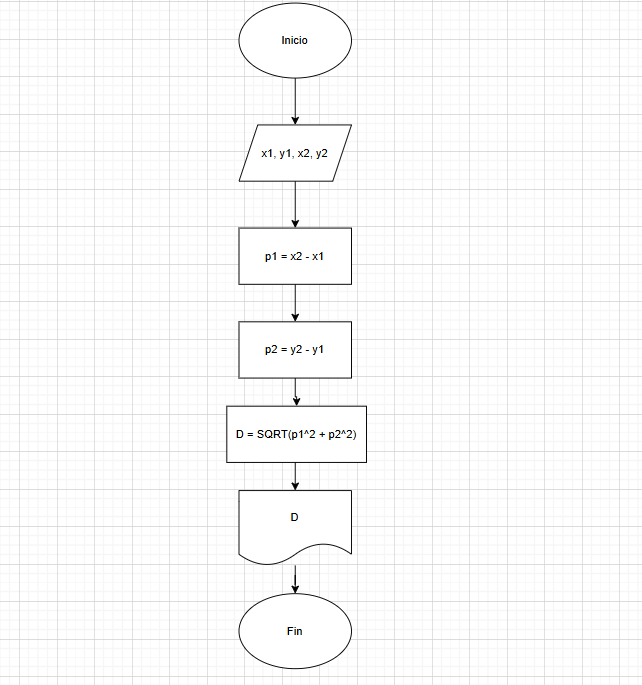
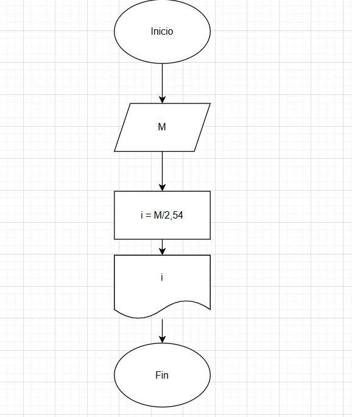
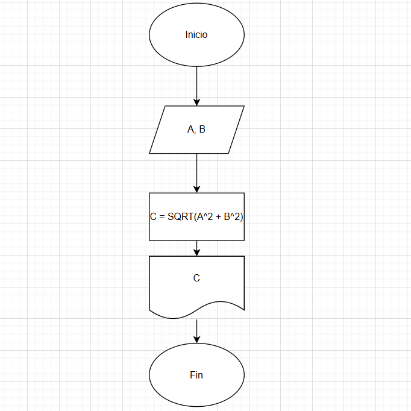

# Retos
1. Se requiere obtener la distancia entre dos puntos en el plano cartesiano,
tal y como se muestra en la figura 1. Realice un diagrama de flujo y pseudocódigo
que representen el algoritmo para obtener la distancia entre
esos puntos.

**pseudocódigo:**  
Inicio  
leer x1, y1, x2, y2  
p1 = x2 - x1  
p2 = y2 - y1  
D = SQRT(p1^2 + p2^2)  
Escribir D  
Fin

**Diagrama:**

2. Una modista, para realizar sus prendas de vestir, encarga las telas al extranjero.
Para cada pedido, tiene que proporcionar las medidas de la tela
en pulgadas, pero ella generalmente las tiene en metros. Realice un algoritmo
para ayudar a resolver el problema, determinando cuántas pulgadas
debe pedir con base en los metros que requiere. Represéntelo mediante un
diagrama de flujo y pseudocódigo (1 pulgada = 0.0254 m).

**Pseudocódigo:**  
Inicio  
Leer cantidad_tela  
cantidad_tela = cantidad_tela % 0,0254   
Escribir cantidad_tela  
Fin

**Diagrama:**

3. Se requiere determinar la hipotenusa de un triángulo rectángulo. ¿Cómo sería el diagrama de flujo y el pseudocódigo que representen el algoritmo para obtenerla? 
Recuerde que por Pitágoras se tiene que: $C^2 = A^2 + B^2$.

**Pseudocódigo:**  
Inicio  
Leer A, B  
C = SQRT(A^2 + B^2)  
Escribir C  
Fin

**Diagrama:**

4. Se requiere determinar la edad actual de una persona basándose en su fecha de nacimiento. Además, es necesario establecer si la persona ya ha cumplido años en el año en curso, si aún no lo ha hecho, o si hoy es su cumpleaños, para celebrarlo. La fecha de nacimiento y la fecha actual estarán representadas mediante tres variables: día, mes y año.
    
    **Instrucciones:**
    
    - Diseñe un algoritmo que permita calcular la edad de la persona.
    - Dentro de la solución, determine si la persona ya celebró su cumpleaños este año o si aún no lo ha hecho.
    - Verifique si la fecha actual corresponde al día de su cumpleaños. De ser así, imprima el mensaje “Feliz Cumpleaños”.
    - Represente la solución utilizando pseudocódigo claro y estructurado.

**Pseudocódigo:**  
Inicio  
Leer día, mes, año  
Leer día_actual, mes_actual, año_actual  
Edad = año_actual - año  
si mes_actual > mes  
   Edad = Edad - 1  
si no mes_actual = mes  
   si día_actual < día  
      Edad = Edad - 1  
   si no día_actual = día  
      Escribir "Feliz cumpleaños"  
    Fin si  
Fin si  
Escribir Edad  
Fin  

5. Realice un algoritmo que permita determinar el sueldo semanal de un trabajador con base en las horas trabajadas y el pago por hora, considerando que a partir de la hora número 41 y hasta la 45, cada hora se le paga el doble, de la hora 46 a la 50, el triple, y que trabajar
más de 50 horas no está permitido. Represente el algoritmo mediante pseudocódigo.

**Pseudocódigo:**  
Inicio  
Leer horas_trabajadas, pago_hora  
sueldo = horas_trabajadas * pago_hora  
si 41 <= horas_trabajadas <=45  
   sueldo = sueldo * 2  
si no 46 <= horas_trabajadas <= 50  
   sueldo = sueldo * 3  
si no horas_trabajadas > 50  
   Escribir "No está permitido"  
Fin si  
Escribir sueldo  
Fin  

6. Se requiere un algoritmo para determinar, de N cantidades, cuántas son cero, cuántas son menores a cero, y cuántas son mayores a cero. Realice el pseudocódigo para representarlo, utilizando el ciclo apropiado.

Inicio  
Leer N   
ceros = 0  
mayorcero = 0  
menorcero = 0   
contador = 0  
Mientras contador <= N  
  Leer X  
   si x = 0  
      ceros = ceros + 1  
   si no x < 0  
      menorcero = menorcero + 1  
   si no x >0  
      mayorcero = mayorcero + 1  
   Fin si  
   contador = contador + 1  
Fin mientras  
Escribir ceros, menorcero, mayorcero  
Fin  

7. Se requiere un algoritmo para determinar cuánto ahorrará en pesos una persona diariamente, y en un año, si ahorra 3¢ el primero de enero, 9¢ el dos de enero, 27¢ el 3 de enero y así sucesivamente todo el año. Represente la solución mediante pseudocódigo.

**Pseudocódigo:**  
Inicio  
días = 1
ahorro_diario = 3
ahoror_total = 0
mientras días <= 365   
  ahorro_diario = 3(3^(días-1))/100  
  escribir ahorro_diario
  ahorro_total = ahorro_total + ahorro_diario  
  días = días + 1  
Fin mientras  
Escribir ahorro_total  
Fin

8. Realice el algoritmo para determinar cuánto pagará una persona que adquiere N artículos, los cuales están de promoción. Considere que si su precio es mayor o igual a $200 se le aplica un descuento de 15%, y si su precio es mayor a $100, pero menor a $200, el descuento es de 12%; de lo contrario, solo se le aplica 10%. Se debe saber cuál es el costo y el descuento que tendrá cada uno de los artículos y finalmente cuánto se pagará por todos los artículos obtenidos. Represente la solución mediante pseudocódigo.

**pseudocódigo:**  
Inicio  
Leer N  
total = 0  
contador = 1  
Mientras contador <= N  
  Leer precio  
  si precio >= 200  
    descuento = precio * 0.15  
  si no precio > 100     
    descuento = precio * 0.12  
  si no  
    descuento = precio * 0.10  
  Fin si  
  precio = precio - descuento  
  total = total + precio  
  contador = contador + 1   
  Escribir precio, descuento    
  Fin Mientras   
  Escribir total  
  Fin
  
9. Realice un algoritmo y represéntelo mediante pseudocódigo para obtener una función exponencial, la cual está dada por:
    
    $𝑒^𝑥 = 1+\frac x {1!} + \frac {x^2}{2!}+ \frac {x^3}{3!}+ …$

Inicio  
Leer x, N  
suma = 1  
termino = 1  
contador = 1  
Mientras contador < N  
  termino = (termino * x) / contador  
  suma = suma + termino  
  contador = contador + 1
Fin Mientras
Escribir suma
Fin

10. Realice un algoritmo para obtener el seno de un ángulo y represéntelo mediante pseudocódigo. Utilice la siguiente ecuación:
$Sen x = x - \frac{x^3}{3!} + \frac{x^5}{5!} - \frac{x^7}{7!} + ...$

Inicio  
Leer x, N  
suma = x  
termino = x  
contador = 1  
Mientras contador < N  
  termino = (-termino * x * x) / ((2 * contador) * (2 * contador +1)) 
  suma = suma + termino
  contador = contador + 1  
Fin Mientras  
Escribir suma   
Fin